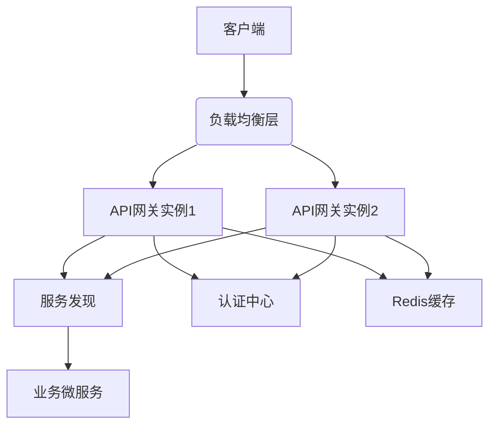

---

### **高性能API网关构建方案**

---

#### **一、架构设计阶段**

##### **1. 确定技术栈**

| 组件     | 技术选型           | 核心考量因素         |
| -------- | ------------------ | -------------------- |
| 开发语言 | Go 1.21+           | 高性能、轻量级协程   |
| Web框架  | Gin + gRPC Gateway | 高性能路由与gRPC支持 |
| 服务发现 | Nacos              | 多数据中心支持       |
| 缓存系统 | Redis Cluster      | 低延迟数据访问       |
| 配置中心 | Apollo/Zookeeper   | 动态配置更新         |
| 监控系统 | Prometheus+Grafana | 指标可视化           |
| 日志系统 | ELK Stack          | 分布式日志处理       |

##### **2. 架构蓝图**



---

#### **二、核心功能实现步骤**

##### **1. 基础路由系统**

```go
// 动态路由配置
func initRouter() *gin.Engine {
    r := gin.New()
    
    // 从配置中心加载路由
    config := apollo.GetRouteConfig()
    for _, route := range config.Routes {
        r.Handle(route.Method, route.Path, 
            createHandler(route.Upstream))
    }
    
    return r
}

func createHandler(upstream string) gin.HandlerFunc {
    return func(c *gin.Context) {
        // 服务发现获取节点
        instances := nacos.GetService(upstream)
        // 负载均衡选择节点
        target := loadbalancer.Select(instances)
        // 反向代理请求
        reverseProxy(c, target)
    }
}
```

##### **2. 认证鉴权模块**

```go
// JWT认证中间件
func JWTAuth() gin.HandlerFunc {
    return func(c *gin.Context) {
        tokenString := c.GetHeader("Authorization")
        claims, err := jwt.ParseWithClaims(tokenString, &CustomClaims{}, 
            func(token *jjwt.Token) (interface{}, error) {
                return []byte(config.SecretKey), nil
            })
        
        if err != nil || !claims.Valid() {
            c.AbortWithStatusJSON(401, gin.H{"error": "Unauthorized"})
            return
        }
        
        c.Set("user", claims.UserInfo)
        c.Next()
    }
}

// 权限验证中间件
func RBAC(requiredRole string) gin.HandlerFunc {
    return func(c *gin.Context) {
        user := c.MustGet("user").(User)
        if !contains(user.Roles, requiredRole) {
            c.AbortWithStatusJSON(403, gin.H{"error": "Forbidden"})
        }
        c.Next()
    }
}
```

##### **3. 流量控制模块**

```go
// 令牌桶限流器
var limiter = rate.NewLimiter(1000, 200) // 1000qps, 200 burst

func RateLimit() gin.HandlerFunc {
    return func(c *gin.Context) {
        if !limiter.Allow() {
            c.AbortWithStatusJSON(429, gin.H{"error": "Too Many Requests"})
            return
        }
        c.Next()
    }
}

// 熔断器配置
hystrix.ConfigureCommand("customer_service", hystrix.CommandConfig{
    Timeout:               1000,
    MaxConcurrentRequests: 100,
    ErrorPercentThreshold: 50,
})

// 熔断中间件
func HystrixWrap(serviceName string) gin.HandlerFunc {
    return func(c *gin.Context) {
        err := hystrix.Do(serviceName, func() error {
            // 执行实际业务逻辑
            return nil
        }, nil)
        
        if err != nil {
            c.AbortWithStatusJSON(503, gin.H{"error": "Service Unavailable"})
        }
    }
}
```

---

#### **三、性能优化专项**

##### **1. 连接池优化**

```go
// Redis连接池配置
var redisPool = &redis.Pool{
    MaxIdle:     100,
    MaxActive:   500,
    Wait:        true,
    IdleTimeout: 240 * time.Second,
    Dial: func() (redis.Conn, error) {
        return redis.Dial("tcp", config.RedisAddr)
    },
}

// HTTP连接复用
var transport = &http.Transport{
    MaxIdleConns:        1000,
    MaxIdleConnsPerHost: 100,
    IdleConnTimeout:     90 * time.Second,
    TLSClientConfig:     &tls.Config{InsecureSkipVerify: true},
}
```

##### **2. 缓存策略设计**

| 缓存层级 | 技术方案            | 命中率优化方法 |
| -------- | ------------------- | -------------- |
| L1       | 内存缓存（LRU策略） | 热点数据预加载 |
| L2       | Redis Cluster       | 一致性Hash分片 |
| L3       | 本地磁盘缓存        | 冷数据持久化   |

```go
// 多级缓存示例
func GetWithCache(key string) ([]byte, error) {
    // 先查内存缓存
    if val, ok := localCache.Get(key); ok {
        return val.([]byte), nil
    }
    
    // 再查Redis
    conn := redisPool.Get()
    defer conn.Close()
    if val, err := redis.Bytes(conn.Do("GET", key)); err == nil {
        localCache.Set(key, val)
        return val, nil
    }
    
    // 最后回源查询
    data, err := fetchFromSource(key)
    if err == nil {
        localCache.Set(key, data)
        conn.Do("SETEX", key, 3600, data)
    }
    return data, err
}
```

##### **3. 协议优化方案**

```protobuf
// gRPC协议定义
service APIGateway {
    rpc HandleRequest(Request) returns (Response) {}
}

message Request {
    string path = 1;
    map<string, string> headers = 2;
    bytes body = 3;
}

message Response {
    int32 status_code = 1;
    map<string, string> headers = 2;
    bytes body = 3;
}

// 使用Protobuf编码替代JSON
```

---

#### **四、监控告警体系**

##### **1. 核心监控指标埋点**

```go
// Prometheus指标定义
var (
    requestsTotal = prometheus.NewCounterVec(
        prometheus.CounterOpts{
            Name: "http_requests_total",
            Help: "Total HTTP requests",
        },
        []string{"method", "path", "status"},
    )
    
    responseTime = prometheus.NewHistogramVec(
        prometheus.HistogramOpts{
            Name:    "http_response_time_seconds",
            Help:    "Response time distribution",
            Buckets: []float64{0.1, 0.5, 1, 2, 5},
        },
        []string{"method", "path"},
    )
)

// 中间件记录指标
func MetricsMiddleware() gin.HandlerFunc {
    return func(c *gin.Context) {
        start := time.Now()
        c.Next()
        
        duration := time.Since(start).Seconds()
        status := strconv.Itoa(c.Writer.Status())
        
        requestsTotal.WithLabelValues(c.Request.Method, c.Request.URL.Path, status).Inc()
        responseTime.WithLabelValues(c.Request.Method, c.Request.URL.Path).Observe(duration)
    }
}
```

##### **2. 告警规则示例**

```yaml
# prometheus_rules.yml
groups:
- name: api-gateway
  rules:
  - alert: HighErrorRate
    expr: sum(rate(http_requests_total{status=~"5.."}[5m])) / sum(rate(http_requests_total[5m])) > 0.05
    for: 10m
    labels:
      severity: critical
    annotations:
      summary: "High error rate detected"
      
  - alert: LatencySpike
    expr: histogram_quantile(0.99, sum(rate(http_response_time_seconds_bucket[5m])) by (le)) > 2
    labels:
      severity: warning
```

---

#### **五、部署实施流程**

1. **基础设施准备**

   ```bash
   # K8s部署示例
   helm install redis bitnami/redis-cluster --values prod-values.yaml
   ```

2. **灰度发布策略**

   ```mermaid
   graph LR
     A[V1版本] --> B{流量切分}
     B --> C[V2版本5%]
     B --> D[V1版本95%]
     C --> E[指标监控]
     E -->|通过| F[全量切换]
     E -->|失败| G[回滚方案]
   ```

3. **压测验证方案**

   | 测试类型 | 工具       | 关键指标                 |
   | -------- | ---------- | ------------------------ |
   | 基准测试 | wrk        | 单节点最大QPS            |
   | 负载测试 | Locust     | 逐步增加压力观察系统表现 |
   | 压力测试 | Vegeta     | 极限压力下的稳定性       |
   | 混沌工程 | Chaos Mesh | 模拟节点故障验证容错能力 |

---

#### **六、关键注意事项**

1. **性能陷阱**
   • 避免在中间件中进行同步IO操作
   • 谨慎使用全局锁，优先使用通道(channel)进行协程间通信
   • 合理设置gRPC的MaxConcurrentStreams参数

2. **安全规范**

   ```nginx
   # Nginx前置配置
   limit_req_zone $binary_remote_addr zone=api_limit:10m rate=1000r/s;
   
   location /api/ {
       limit_req zone=api_limit burst=200;
       proxy_pass http://gateway;
   }
   ```

3. **版本管理策略**

   ```bash
   # 使用API版本控制
   /api/v1/users
   /api/v2/users
   ```

---

通过以上方案实施，可构建出支持**10万级QPS**、**毫秒级响应**的企业级API网关。建议优先实现核心路由与限流功能，逐步完善监控与安全模块，最终形成完整的API治理体系。

